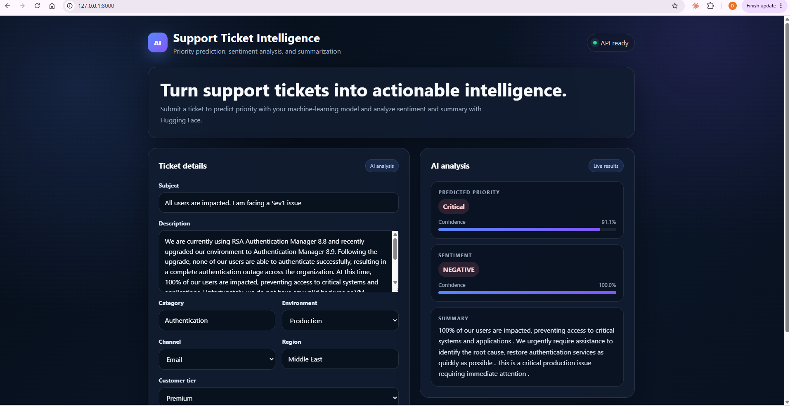

# AI Support Ticket Intelligence Platform

An end-to-end AI application that turns support tickets into actionable intelligence. It predicts ticket priority with a supervised machine-learning model, analyzes sentiment, and summarizes long descriptions through a FastAPI service and browser-based interface.



## Features

- Predicts support-ticket priority and returns a confidence score
- Classifies ticket sentiment with a Hugging Face transformer
- Summarizes long ticket descriptions
- Combines free-text features with ticket metadata
- Provides a responsive web interface
- Exposes each AI capability through a FastAPI endpoint

## How it works

The priority classifier combines the ticket subject and description with category, environment, channel, region, and customer tier. Text is transformed with TF-IDF, categorical values are one-hot encoded, and logistic regression predicts the priority class.

Sentiment analysis uses `distilbert-base-uncased-finetuned-sst-2-english`. Summarization uses `sshleifer/distilbart-cnn-12-6`.

## Project structure

```text
.
├── app.py
├── ai_support_ticket_intelligence.py
├── sentiment_service.py
├── summarization_service.py
├── index.html
├── ai_support_ticket_training_data_realistic_v2.csv
├── models/
│   ├── label_encoder.pkl
│   └── priority_model.pkl
├── assets/
│   └── support-ticket-intelligence.png
└── requirements.txt
```

## Setup

1. Create and activate a virtual environment:

   ```bash
   python -m venv .venv
   ```

   Windows:

   ```powershell
   .\.venv\Scripts\Activate.ps1
   ```

   macOS or Linux:

   ```bash
   source .venv/bin/activate
   ```

2. Install the dependencies:

   ```bash
   pip install -r requirements.txt
   ```

3. Start the application:

   ```bash
   uvicorn app:app --reload
   ```

4. Open [http://127.0.0.1:8000](http://127.0.0.1:8000).

The first run may take longer because the Hugging Face models are downloaded and the priority model is trained.

## API endpoints

| Method | Endpoint | Purpose |
| --- | --- | --- |
| `GET` | `/` | Opens the web interface |
| `GET` | `/predict-priority` | Predicts ticket priority |
| `GET` | `/analyze-sentiment` | Analyzes ticket sentiment |
| `GET` | `/summarize-ticket` | Summarizes a ticket description |

Interactive API documentation is available at [http://127.0.0.1:8000/docs](http://127.0.0.1:8000/docs) while the server is running.

## Technology

Python, FastAPI, pandas, scikit-learn, Hugging Face Transformers, PyTorch, HTML, CSS, and JavaScript.
