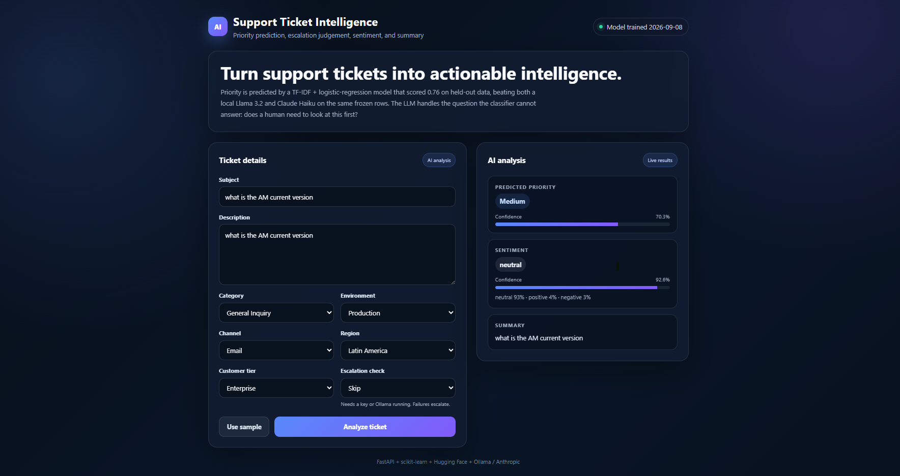
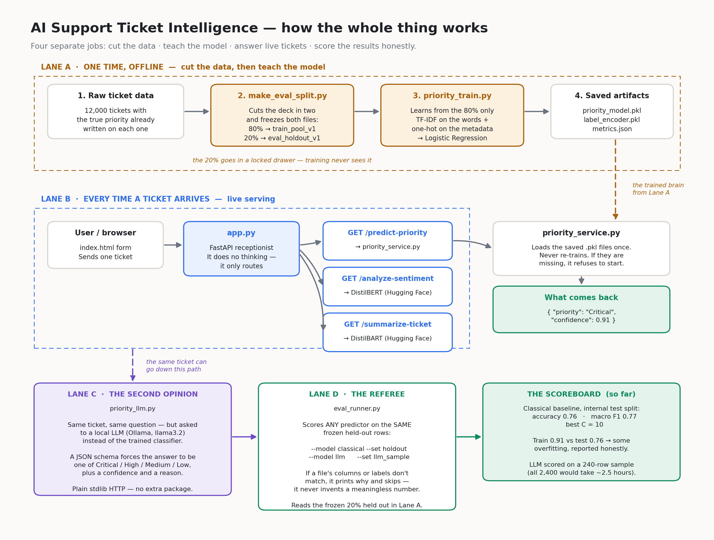

# AI Support Ticket Intelligence

Reads a support ticket and works out how urgent it is, whether a human should look at it first, how the customer sounds, and what it says in one line.

There is a small web page to try it in, and a FastAPI service behind it.



---

## The short version

This started as "add an LLM and see if it's better."

It wasn't. Measuring *why* changed the design, and that is what the project is actually about.

**Every model below was scored on the same 240 frozen tickets.** Same rows, same labels, no re-splitting between runs.

| Model | Accuracy | Serious mistakes* | Real emergencies caught |
|---|---|---|---|
| **TF-IDF + Logistic Regression** | **0.74** | **0.0%** | 80% |
| Claude Haiku, 2 examples per class | 0.52 | 2.1% | 30% |
| Claude Haiku, 8 examples per class | 0.51 | 5.8% | 26% |
| Llama 3.2 3B, 2 examples per class | 0.47 | 15.0% | 70% |

On the full 2,400-row holdout the classical model scores **0.76 accuracy, 0.77 macro F1**, with **one** serious mistake in 2,400 tickets.

\* Wrong by two or more levels — calling a Critical ticket Medium, say. In real triage this matters more than accuracy. Being one level off is a nuisance. Being two levels off means an outage sits in the normal queue.

Three things worth noticing:

**The simple model won, and not narrowly.** A logistic regression beat a frontier LLM by 22 points, runs in about a millisecond, and costs nothing per call.

**More examples made it worse.** Going from 2 to 8 few-shot examples dropped Haiku from 0.52 to 0.51, and nearly tripled its serious-mistake rate. The obvious fix was tested and rejected.

**The two LLMs failed in opposite directions.** Haiku was too cautious, catching only 30% of real emergencies. Llama 3.2 barely used the "High" label at all (13% recall) and scattered tickets into Critical or Medium instead.

So the classical model ships. The LLM moved to a job it is actually suited to.

---

## How it works



Four separate jobs. Keeping them separate is most of the design.

**1 · Cut the data.** `make_eval_split.py` splits 12,000 tickets into 9,600 for training and 2,400 locked away. Both files are written to disk and the script refuses to overwrite them. Training physically cannot read the locked 2,400, so a good score cannot come from having already seen the answers.

**2 · Train.** `priority_train.py` learns from the 9,600 only — TF-IDF on the text, one-hot on the dropdown fields, logistic regression on top, hyperparameters chosen by grid search. It saves the finished model to `models/`.

**3 · Serve.** `app.py` receives a request and routes it. `priority_service.py` only ever *loads* the saved model; it never trains. If the model files are missing it refuses to start rather than quietly retraining.

*Why that matters:* an earlier version had training and prediction in one file, so importing it to get a single prediction re-ran the whole training job. Splitting them makes that mistake impossible rather than merely discouraged.

**4 · Score.** `eval_runner.py` grades any predictor on the locked-away rows. If a file does not match what the model expects, it prints exactly what is wrong and skips it. It never produces a number it cannot stand behind.

---

## Where the LLM ended up

Losing the priority benchmark was informative: in this dataset, priority is largely a function of the dropdown fields, which a classifier learns easily and an LLM reasoning from prose does not.

But there is a harder question a classifier cannot answer at all: **does a human need to see this before anything automated happens?**

That needs judgement about tone and intent — a customer downplaying their own outage, or a calm question that is really describing a security breach. Reasoning, not classification.

So the LLM path was rebuilt around escalation:

| File | Job |
|---|---|
| `llm/escalation_llm.py` / `escalation_llm_anthropic.py` | Ask the model (local Ollama, or Claude Haiku) |
| `llm/llm_validation.py` | Validate the escalation answer, retry if malformed |
| `llm/priority_validation.py` | Validate the priority answer, retry with the error fed back, fail closed |
| `llm/escalation_policy.py` | Decide what to *do* with the answer |
| `evaluation/escalation_eval_runner.py` | Score it against 18 hand-written hard cases |
| `evaluation/guardrail_hallucination_test.py` | Check the model is not inventing details |

Two decisions worth calling out:

**Retries are for bad answers, not outages.** Malformed JSON is often transient, so we try again. An unreachable server is not, so we fail immediately. Retrying a connection that is genuinely down wastes time and hides the real problem.

**When in doubt, escalate.** If the model says no but admits low confidence, a human still looks. If it never returns a valid answer, a human still looks. If the provider is unreachable, a human still looks. The system fails towards a person, never towards silence.

---

## Getting started

Developed on Python 3.14; 3.10 or newer should work.

```bash
python -m venv .venv
source .venv/bin/activate          # Windows: .\.venv\Scripts\Activate.ps1
pip install -r requirements.txt
```

Prepare the data and train the model (once):

```bash
python -m scripts.make_eval_split       # splits the raw data, freezes both halves
python -m scripts.priority_train        # trains, saves to models/
```

Start the API:

```bash
uvicorn ticket_intelligence.app:app --reload
```

Open <http://127.0.0.1:8000>. The first run downloads the Hugging Face models, so give it a minute.

Run every command from the repository root — that is what puts `ticket_intelligence` on the import path.

### Reproduce the benchmark

```bash
python -m evaluation.eval_runner --model classical     --set holdout
python -m evaluation.eval_runner --model llm-anthropic --set llm_sample   # needs ANTHROPIC_API_KEY
python -m evaluation.eval_runner --model llm-ollama    --set llm_sample   # needs Ollama running

python -m evaluation.escalation_eval_runner --model both
python -m evaluation.sentiment_eval_runner  --model both
python -m evaluation.guardrail_hallucination_test --model both

python -m evaluation.threshold_sweep --model anthropic   # escalation tradeoff curve
python -m evaluation.threshold_sweep --model stub        # harness check, no provider
```

For the Anthropic paths, copy `.env.example` to `.env` and add your key.

Raw output from the benchmark runs is kept in `logs/` — those files are the evidence behind the numbers above.

---

## API

| Method | Endpoint | What it does |
|---|---|---|
| `POST` | `/triage` | Priority + confidence, and optionally an escalation decision |
| `GET` | `/health` | Model file, training date, label classes, training-time accuracy |
| `GET` | `/schema` | The exact field values the trained model accepts |
| `GET` | `/analyze-sentiment` | Sentiment across three classes |
| `GET` | `/summarize-ticket` | Short summary |
| `GET` | `/predict-priority` | Legacy — superseded by `POST /triage` |

Interactive docs at <http://127.0.0.1:8000/docs>.

`/triage` takes a JSON body rather than query parameters, so a long ticket description never travels in a URL where it would hit length limits and be written to access logs in plaintext.

`/schema` exists because the web form used to hard-code its dropdown options, and four of them were values the model had never seen. The encoder ignores unknown values silently, so those tickets got a quietly different answer with no warning — changing `environment` from `Production` to an unknown value moved the sample ticket from High 0.83 to Medium 0.57, with nothing to indicate it. The page now builds its dropdowns from this endpoint, and the request model's fields are enums derived from the fitted encoder, so an unknown value is a 422 rather than a degraded answer.

---

## Layout

```
ticket_intelligence/          importable code
├── app.py                    FastAPI routes only, no model logic
├── priority_features.py      shared paths, columns, data loading
├── priority_service.py       loads the trained model and predicts
├── api_models.py             request/response models, enums built from the model
├── guardrails.py             invented-detail detector
├── sentiment_service.py      three-class sentiment
├── summarization_service.py  DistilBART summarisation
└── llm/
    ├── priority_llm.py               priority via local Ollama
    ├── priority_llm_anthropic.py     priority via Claude Haiku
    ├── escalation_llm.py             escalation via Ollama
    ├── escalation_llm_anthropic.py   escalation via Claude Haiku
    ├── llm_validation.py             escalation validation + retry
    ├── priority_validation.py        priority validation, retry, fail closed
    └── escalation_policy.py          model answer -> system decision

scripts/                      run by hand
├── make_eval_split.py        freezes the train / holdout split
├── make_llm_eval_sample.py   freezes the 240-row benchmark sample
└── priority_train.py         trains the classifier

evaluation/                   every number in this README comes from here
├── eval_runner.py                    priority, any predictor
├── escalation_eval_runner.py         escalation judgement
├── sentiment_eval_runner.py          sentiment, old model vs new
├── threshold_sweep.py                confidence -> escalation tradeoff curve
└── guardrail_hallucination_test.py   invented-detail screen

static/index.html             the web interface
assets/                       screenshots used in this README
data/                         frozen datasets, never overwritten in place
models/                       trained model, label encoder, metrics
logs/                         raw benchmark output
tests/                        provider-free by default, `-m llm` for the rest
docs/INTERVIEW_NOTES.md       why each decision was made
```

---

## Guardrails and tests

Three claims this project makes, and where each one is enforced.

**LLM output is validated, and failure is closed.** Every priority prediction is parsed through a Pydantic model — `priority` is an enum of exactly the four labels, `confidence` a float in [0, 1], `reasoning` a non-empty string. On a validation failure the provider is called once more with the error fed back, then it raises. It never falls back to a default label: a silently defaulted prediction is worse than a refusal, because it enters the metrics as a real answer. The parse-failure rate is counted and reported.

**Confidence drives escalation, and the tradeoff is measured.** `evaluation/threshold_sweep.py` scores the rule "escalate below threshold T" against the 18 hard cases and sweeps T from 0.50 to 0.90:

```bash
python -m evaluation.threshold_sweep --model anthropic
python -m evaluation.threshold_sweep --model stub      # no provider needed
```

It reports correct escalations, **missed escalations** (confident on a case that needed a human — the dangerous class), and the over-escalation rate, against the two baselines: never-escalate misses all 6, always-escalate catches all 6 while being wrong on all 12 others.

It also prints a **length-confound check**. If the system escalates HARD-018 — the calm security question — that could mean it understood the security implication, or just that short tickets get low confidence. Those look identical in the metrics and are entirely different capabilities. The Spearman correlation between description length and confidence says which one you are looking at.

**Invented details are detected, not just prohibited.** `ticket_intelligence/guardrails.py` compares generated text against the ticket it was shown and flags version numbers, case IDs, dates, multi-digit counts and named systems that appear in the output but not the input. It is a screen, not a proof — it will miss an invented *cause* stated in ordinary prose — and the docstring says so.

### Running the tests

```bash
pytest                 # provider-free: schema, retry contract, detector, request validation
pytest -m llm          # adds the bait-ticket tests; needs Ollama or an API key
```

The split is deliberate. A guardrail test that only runs when someone remembers to start Ollama is a script, not a guardrail — so everything enforceable without a provider is in the default selection, needing neither an API key nor `transformers`. That also makes the suite CI-ready; a workflow is not wired up yet.

---

## Honest limitations

**The data is synthetic.** 12,000 generated tickets. Real ones are messier, and these numbers would not survive contact with them unchanged.

**The model overfits somewhat.** 0.91 on training data against 0.76 held out. Reported as-is rather than tuned away, because the held-out number is the one that means anything.

**It has only been tested on tickets that look like its training data.** An exploratory probe against the 18 hand-written hard cases suggests it degrades sharply on unusual tickets: it missed both Critical cases, and flagged one of them Medium at 0.81 confidence. That probe needed two assumptions to run at all — a severity-scale mapping, and filling in four columns the file does not have — so it is not in the table above. The direction is clear enough to act on: **the confidence score is not a safety net for unfamiliar tickets.**

**Sentiment is the wrong frame, and only partly fixed.** The original model was trained on movie reviews and had exactly two labels, so it had nowhere to put a neutral question. "What is the current version?" came back **NEGATIVE at 0.89** — not an unlucky guess, but a forced choice, since a softmax over two classes has to spend all its mass somewhere. Most tickets are neutral, so this was the common case rather than an edge case.

Replacing it with a three-class model fixed that specific failure — the same question now returns **neutral 0.93**, with negative at 0.03 — and the interface shows every class score so a forced choice is visible rather than hidden behind one number.

What is *not* fixed is the framing. Tone and severity are different axes: "our certificate expires in six days" is calmly worded and operationally urgent. A sentiment model measures the axis that matters less. The useful signal for triage would be customer frustration, which is a different label space and a different model.

**The escalation numbers are not in this README yet.** The harness and the threshold sweep exist and run; the results of a real provider run are not recorded here.

**Confidence is self-reported, not calibrated.** The threshold sweep treats an LLM's own confidence float as a signal. It is not a probability, and the length-confound check exists precisely because it may be measuring something other than certainty.

**No CI, no auth, no container.** The test suite is written to run without a provider, but no CI workflow is committed. The API has no authentication or rate limiting, and there is no Dockerfile. This runs on a laptop; it is not deployed and is not claimed to be.

**Only 240 rows in the LLM comparison.** The classical model scores 2,400 rows in under a second; the LLM path takes several seconds per ticket. 240 stratified rows keeps the comparison runnable while giving each class 50–70 examples. Do not read anything into the second decimal place.

---

## Built with

Python · FastAPI · scikit-learn · pandas · Pydantic · Hugging Face Transformers · Ollama · Anthropic API
